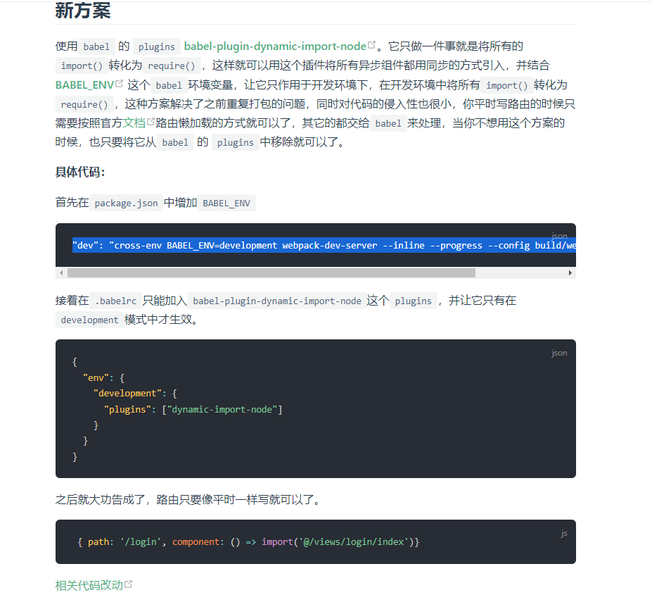

## vue-element-admin学习笔记
1. :项目开发中的dev, test, staging ,prod 环境 是什么意思
答:开发环境（dev） 测试环境 （test）生产环境（prod）staging server:可以理解为production环境的镜像.大多数是对新版本做最后一轮测试

2. :保证页面在框架内部,如顶栏|导航栏不随着页面变动而变动 在router 中进行配置
``` js 
// No layout
{
  path: '/401',
  component: () => import('errorPage/401')
}

// Has layout
{
  path: '/documentation',

  // 你可以选择不同的layout组件 在这里选择
  component: Layout,

  // 这里开始对应的路由都会显示在app-main中 如上图所示
  children: [{
    path: 'index',
    component: () => import('documentation/index'),
    name: 'documentation'
  }]
}
```
3. 缓存路由组件,保证有需要的组件不被销毁 配合路由中配置使用 注明哪些组件不失活
```vue
<keep-alive :include="cachedViews">
    <router-view :key="key" />
</keep-alive>
```
4. 部分页面是使用同一个component，默认情况下这两个页面切换时并不会触发 vue 的 created 或者 mounted 钩子.需要添加上一个唯一的 key
``` vue
<router-view :key="key"></router-view>
computed: {
  key() {
    // 只要保证 key 唯一性就可以了，保证不同页面的 key 不相同
    return this.$route.fullPath
  }
 }
 ```
5. 代码规范: 路由分为两种constantRoutes 和 asyncRoutes
constantRoutes  代表那些不需要动态判断权限的路由，如登录页、404、等通用页面
asyncRoutes 代表那些需求动态判断权限并通过 addRoutes 动态添加的页面
路由的目的不同的,方式也不同. 以后补上

这里有一个需要非常注意的地方就是 404 页面一定要最后加载，如果放在 constantRoutes 一同声明了 404 ，后面的所有页面都会被拦截到404

6. 点击导航栏不刷新的问题 vue特点 当前URL 链接不变,就不会刷新.
   是一个难点 解决方法.现在采取的方案是判断当前点击的菜单路由和当前的路由是否一致，若一致的时候，会先跳转到一个专门 Redirect 的页面，它会将路由重定向到我想去的页面，这样就起到了刷新的效果了
引用场景:全局 size 大小切换按钮 切换字体大小 先切换页面 就可以重新刷新数据 
```js
先跳转到其他页面
const { fullPath } = this.$route
this.$router.replace({
  path: '/redirect' + fullPath
})

再重定向回来
export default {
  beforeCreate() {
    const { params, query } = this.$route
    const { path } = params
    this.$router.replace({ path: '/' + path, query })
  },
  render: function(h) {
    return h() // avoid warning message
  }
}
```
7. 侧边栏中也是可以配置一个外链，只要你在 path 中填写了合法的 url 路径，当你点击侧边栏的时候就会帮你新开这个页面。
``` js
{
  "path": "external-link",
  "component": Layout,
  "children": [
    {
      "path": "https://github.com/PanJiaChen/vue-element-admin",
      "meta": { "title": "externalLink", "icon": "link" }
    }
  ]
}
```
8. 前端路由权限的实现方式是：
通过获取当前用户的权限去比对路由表，
生成当前用户具有的权限可访问的路由表，通过 router.addRoutes 动态挂载到 router 上。

9. 模板中,添加了Affix 图钉所以 不可以删除.
在router中的meta中指定
``` js
meta: {
    title: 'dashboard',
    icon: 'dashboard',
    noCache: true,
    affix: true
    }
    ```
10. 请记住拆分组件最大的好处不是公用而是可维护性！ 不是为了复用方便 是为了以后的维护方便
写vue的好习惯 全局的 @/components 只会写一些全局的组件，如富文本，各种搜索组件，封装的日期组件等等能被公用的组件。每个页面或者模块特定的业务组件则会写在当前 views 下面

11.自定义 element-ui 样式 重点 很有用
由于 element-ui 的样式我们是在全局引入的，所以你想在某个页面里面覆盖它的样式就不能加 scoped 直接style的方式
但你又想只覆盖这个页面的 element 样式，你就可在它的父级加一个 class，用命名空间来解决问题
```css
示例代码
.article-page {
  /* 你的命名空间 */
  .el-tag {
    /* element-ui 元素*/
    margin-right: 0px;
  }
}
```
若是想覆盖某个特定页面 element 的 button 的样式  在预处理css 中就可以用 /deep/ 去代替button
.xxx-container >>> .el-button{
  xxxx
}

12. 设置多个 baseURL 需要请求的数据不在同一个服务器
```
VUE_APP_BASE_API = '/dev-api' #注入本地 api 的根路径
VUE_APP_BASE_API2 = '/dev-api2' #注入本地 api2 的根路径
```
```js 
通过封装多个axios 实例来实现对不同baseURL 发送请求
// create an axios instance
const service = axios.create({
  baseURL: process.env.BASE_API, // api 的 base_url
  timeout: 5000 // request timeout
})

const service2 = axios.create({
  baseURL: process.env.BASE_API2, // api2 的 base_url
  timeout: 5000 // request timeout
})
```

13. Mock.js 它重写了XMLHttpRequest对象，所以比如progress方法，或者一些底层依赖XMLHttpRequest的库都会和它发生不兼容 
    实际上不会走任何网络请求。所以本地调试起来很蛋疼，

14. 切换不同请求地址 可以通过环境变量来做到不同环境下，请求不同的 api 地址。
    `VUE_APP_BASE_API = '/dev-api' #注入本地 api 的根路径`
    `VUE_APP_BASE_API = '/prod-api' #注入线上 api 的根路径`
``` js
axios 实例的创建
const service = axios.create({
  baseURL: process.env.BASE_API, // api 的 base_url
  timeout: 5000 // request timeout
})
```
15. 环境变量必须以VUE_APP_为开头。如:VUE_APP_API、VUE_APP_TITLE
    通过如下方式获取:
    `console.log(process.env.VUE_APP_xxxx)`

16. 部署时可能会发现资源路径不对 ,只需修改 vue.config.js 文件资源路径即可。
    `publicPath: './' //请根据自己路径来配置更改`


## 跨域问题
1. cors
2. 开发中proxy|生产中nginx


## 解决本地打包慢的问题


## 实现echart 的自适应
ECharts 本身并不是自适应的，当你父级容器的宽度发生变化的时候需要手动调用它的 .resize() 方法。
 所有比如 el-tab，你可以监听 change 事件，当变化时找到这个图表之后调用它的 .resize() 方法。